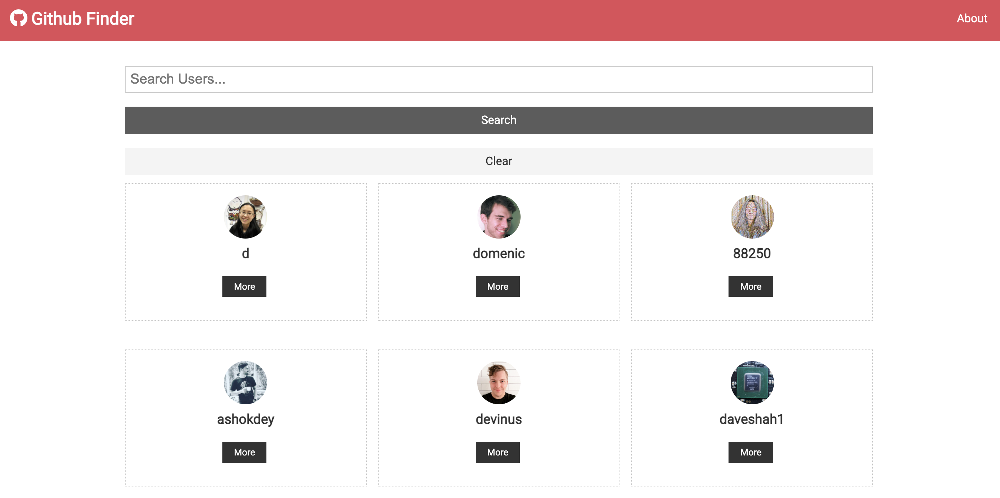

 ### Github Finder - React SPA to find Github user info 

```
git clone https://github.com/gpldirk/Github-Finder.git
```

```
cd Github-Finder && npm install
```

```
npm start
```

#### Screen Shoot



Netlify Link: https://usc-github-finder.netlify.app/


